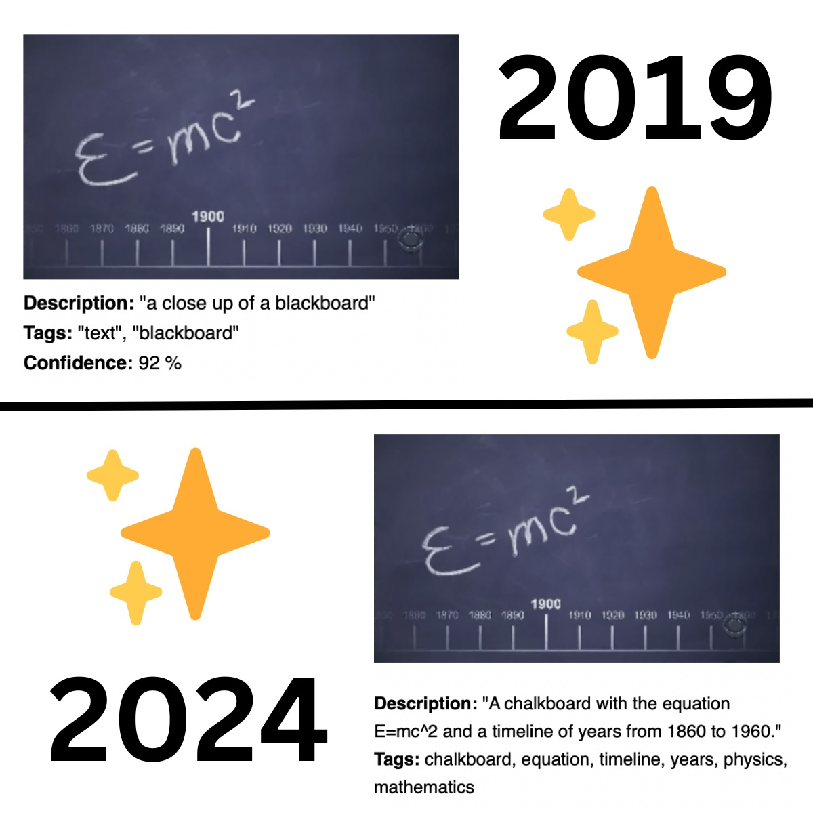

# Big Bang Theory through an AI Lens

## Project Overview

This project shows the evolution of computer vision technology by analyzing frames from the opening sequence of the Big Bang Theory. 

By comparing outputs from 2019 and 2024, we can observe significant advancements in AI capabilities.

- [2019 Analysis](2019.md)
- [2024 Analysis](2024.md)

### 2019

In 2019, I utilized Azure AI services' Computer Vision (formerly Cognitive Services) to analyze the frames. The results provided a basic understanding of the content in each frame, albeit with some limitations in detail and accuracy.

#### Techniques Used in 2019

- **01-analyze_bbt.sh**: Used a shell script to call the Azure Computer Vision API for analyzing each image.
- **02-gen-page.sh**: Another shell script was employed to generate a markdown file from the API responses, including descriptions, tags, and confidence levels.

### 2024

Fast forward to 2024, I employed LLama 3.2 90B Vision Instruct for the same task. The results were more detailed and context-rich, though they also presented new quirks, such as occasional hallucinations and mood-like behaviors in the AI responses.

#### Techniques Used in 2024

- **Python Script**: A Python script was used to interact with the OpenRouter API utilizing the LLama 3.2 Vision Instruct model to analyze each image. This script ensured detailed descriptions and relevant tags in the responses.

## Key Observations

1. **Detail and Accuracy**:
    - **2019**: Simple and sometimes vague descriptions.
    - **2024**: Rich, detailed descriptions but prone to overconfidence and hallucinations.

2. **Performance Consistency**:
    - **2019**: Consistent but occasionally lacked specificity.
    - **2024**: Mostly accurate but exhibited mood swings and occasional refusals.

3. **Error Handling**:
    - **2019**: Explicitly indicated uncertainty with low confidence scores.
    - **2024**: More sophisticated but sometimes misled by its own capabilities.

This project is licensed under the MIT License - see the [LICENSE](LICENSE) file for details.
